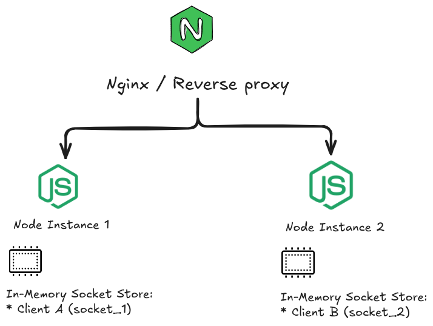
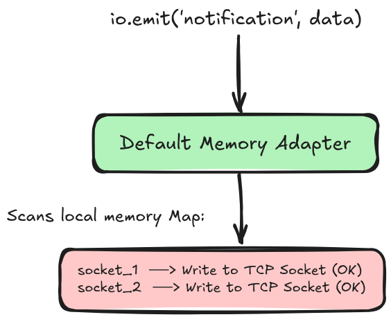
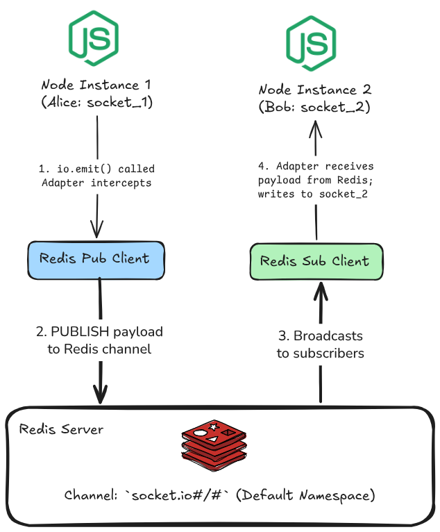
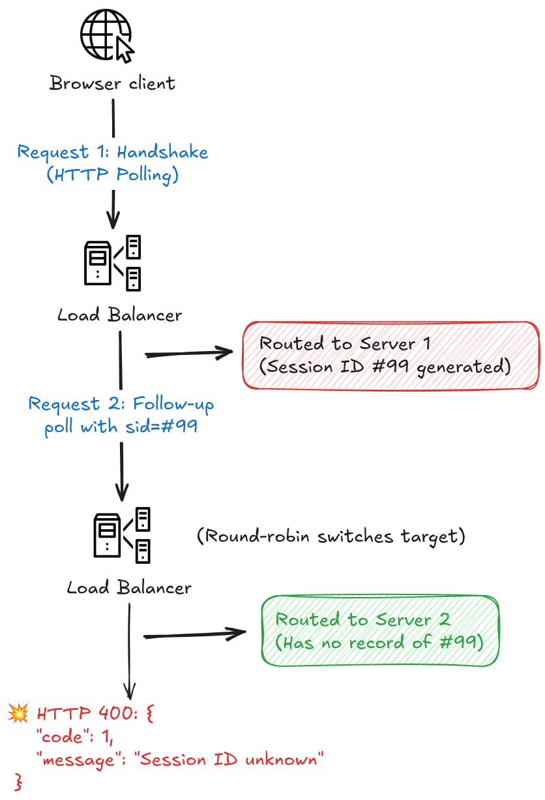

# Scaling Socket.IO Horizontally: Why Your Real-Time Architecture Breaks Beyond a Single Process

## Part 1: The Illusion of Single-Server Simplicity

WebSockets are the foundation of modern interactive web apps. Whether you are synchronizing live cursor movements in a collaborative canvas, streaming inference progress from a background AI job, pushing real-time order tracking updates, or delivering financial ticks, persistent full-duplex TCP connections make instant client updates trivial.

During early development, building these features with `Socket.IO` in Node.js feels seamless. You initialize an HTTP server, attach a Socket.IO instance, listen for incoming connections, and push updates using io.emit() or room-based targeting:

```js
// A typical single-server broadcast
io.to("project:402").emit("task_updated", { status: "completed" });
```

On a single development server, this works flawlessly. The server receives the update, locates all connected clients listening on project:402, and pushes the payload down their active TCP connections.

However, this architecture relies on a silent, fragile assumption: **every connected client lives in the same process memory.**

### The Bottleneck: Horizontal Scaling and Isolated Memory

A single Node.js process runs on a single thread and is bounded by operating system memory limits (typically 1.4 GB to 2 GB of V8 heap by default). As active concurrent connections grow from hundreds to tens of thousands, a single CPU core becomes a hard throughput bottleneck.

To scale, you do what every production engineer does: scale horizontally. You spin up multiple Node.js worker processes across multiple CPU cores using PM2 or Docker containers, placing them behind a reverse proxy like Nginx or an AWS Application Load Balancer.

The moment you introduce that second server instance, your real-time communication silently breaks.



Node.js processes adhere strictly to a shared-nothing architecture. Process A and Process B inhabit isolated virtual memory spaces. They cannot inspect, access, or manipulate each other's data structures.

When Client A and Client B land on different instances:

1. Client A establishes a WebSocket connection routed by the load balancer to Node Instance 1. Instance 1 allocates a socket reference in its local heap memory.

2. Client B connects and is routed to Node Instance 2. Instance 2 records Client B in its own separate heap.

3. When Client A performs an action that triggers `io.emit('event', payload)` inside Instance 1, Instance 1 can only iterate over its own local registry.

4. Instance 1 has no visibility into Instance 2. As a result, the event is dispatched to Client A (and anyone else attached to Instance 1), while Client B never receives the payload.

The exact same breakdown occurs with Socket.IO rooms (`socket.join('room-name')`). If two users join the same logical room on different physical servers, the room exists only as a local key in each server's memory map. Room broadcasts become completely siloed.

To scale real-time applications horizontally, servers cannot rely on local process memory as the source of truth for client communication. They require a centralized, high-throughput message bus that sits outside the application layer.

---

## Part 2: Reproducing the Breakdown Locally

To see why in-memory WebSocket architectures fail under horizontal scaling, you don't need a complex cloud cluster. You can reproduce the exact failure on localhost by running two instances of a basic Node.js server on different ports.

### 1. Project Setup

Initialize an isolated Node.js environment and configure it to use ES Modules:

```Bash
mkdir socket-scaling-demo
cd socket-scaling-demo
npm init -y
npm pkg set type="module"
npm install express socket.io socket.io-client
```

### 2. The Minimal Server (`server.js`)

Create a `server.js` file that reads a `PORT` environment variable, binds Socket.IO, and listens for a generic `broadcast_event`:

```js
import http from "node:http";
import express from "express";
import { Server } from "socket.io";

const app = express();
const server = http.createServer(app);

const io = new Server(server, {
  cors: { origin: "*" },
});

const PORT = process.env.PORT || 3001;
const INSTANCE_NAME = process.env.INSTANCE_NAME || `Instance-${PORT}`;

io.on("connection", (socket) => {
  console.log(`[${INSTANCE_NAME}] Client connected: ${socket.id}`);

  // When a client sends a message, attempt to broadcast it to all connected sockets
  socket.on("broadcast_event", (data) => {
    console.log(
      `[${INSTANCE_NAME}] Received broadcast request from ${socket.id}:`,
      data,
    );

    // io.emit() should theoretically reach everyone
    io.emit("notification", {
      origin: INSTANCE_NAME,
      sender: socket.id,
      payload: data,
    });
  });

  socket.on("disconnect", () => {
    console.log(`[${INSTANCE_NAME}] Client disconnected: ${socket.id}`);
  });
});

server.listen(PORT, () => {
  console.log(`>>> ${INSTANCE_NAME} listening on http://localhost:${PORT}`);
});
```

### 3. Spawning Two Isolated Server Instances

Open two separate terminal tabs and start two distinct instances representing two worker processes behind a load balancer:

- Terminal 1 (Server Instance A):

```Bash
PORT=3001 INSTANCE_NAME="Server-A" node server.js
```

- Terminal 2 (Server Instance B):

```Bash
PORT=3002 INSTANCE_NAME="Server-B" node server.js
```

Both instances are now live on your machine, bound to different network ports, and executing in completely segregated memory spaces.

### 4. Simulating Distributed Clients (`test-clients.js`)

Now create a test runner script (`test-clients.js`) to simulate two separate users.

- Client 1 connects to Server-A (`:3001`).

- Client 2 connects to Server-B (`:3002`).

```js
import { io } from "socket.io-client";

// Client 1 lands on Server A
const client1 = io("http://localhost:3001", { transports: ["websocket"] });

// Client 2 lands on Server B
const client2 = io("http://localhost:3002", { transports: ["websocket"] });

client1.on("connect", () => {
  console.log(`[Client 1] Connected to Server-A (ID: ${client1.id})`);
});

client2.on("connect", () => {
  console.log(`[Client 2] Connected to Server-B (ID: ${client2.id})`);
});

// Listen for incoming notifications on both clients
client1.on("notification", (msg) => {
  console.log(`[Client 1] Received notification:`, msg);
});

client2.on("notification", (msg) => {
  console.log(`[Client 2] Received notification:`, msg);
});

// Wait 1 second for handshakes to settle, then emit an event from Client 1
setTimeout(() => {
  console.log(
    '\n>>> Client 1 emitting: "broadcast_event" -> "Task #402 Finished"\n',
  );
  client1.emit("broadcast_event", { task: "Task #402 Finished" });
}, 1000);
```

- Run the test runner in a third terminal:

```Bash
node test-clients.js
```

### 5. The Result: Silent Event Dropping

Look closely at your terminal output:

```Plaintext
[Client 1] Connected to Server-A (ID: Wk9vA8j_...)
[Client 2] Connected to Server-B (ID: gU4sZ2m_...)

>>> Client 1 emitting: "broadcast_event" -> "Task #402 Finished"

[Client 1] Received notification: {
  origin: 'Server-A',
  sender: 'Wk9vA8j_...',
  payload: { task: 'Task #402 Finished' }
}
```

Client 1 receives its own reflected notification from Server-A, but Client 2 receives absolutely nothing.

- Inspect Terminal 1 (Server-A):

```Plaintext
[Server-A] Client connected: Wk9vA8j_...
[Server-A] Received broadcast request from Wk9vA8j_...: { task: 'Task #402 Finished' }
```

- Inspect Terminal 2 (Server-B):

```Plaintext
[Server-B] Client connected: gU4sZ2m_...
```

(Complete silence.)

`Server-A` did exactly what its code instructed: it queried its internal heap, found all sockets in its local memory pool (`Wk9vA8j_...`), and dispatched the TCP packet. It had no mechanism to notify `Server-B` that a global event occurred.

In a production environment where tens of thousands of users are randomly distributed across 10 container replicas, over **90% of your users will miss every broadcast event.**

## Part 3: Redis as the Distributed Pub/Sub Backbone

To bridge the gap between isolated Node.js processes, we need a communication channel that operates outside application memory. The channel must be extremely fast—introducing less than a millisecond of overhead—so real-time events don't lag behind.

This is where **Redis** comes in.

While developers commonly think of Redis as a key-value cache or a session store, Redis includes a native, lightweight messaging pattern: **Publish/Subscribe (Pub/Sub)**.

### Understanding Redis Pub/Sub in 60 Seconds

Redis Pub/Sub is a pure fire-and-forget message broker. It does not store messages on disk, track delivery status, or maintain historical logs:

1. Publishers send messages to named channels (e.g., `PUBLISH channel_orders '{"id": 402}'`).

2. Subscribers listen on those channels (e.g., `SUBSCRIBE channel_orders`).

3. Whenever a message is published, Redis broadcasts a copy of that payload across the network to **all connected subscribers in memory simultaneously**.

Because Redis runs in C and keeps all channel mappings in memory, routing a packet between clients typically takes fractions of a millisecond.

#### The Default: Socket.IO's In-Memory Adapter

Under the hood, Socket.IO relies on an abstraction called an Adapter.

- Whenever you invoke a broadcast method:

```js
io.emit("event", payload);
// or
io.to("room-1").emit("event", payload);
```

Socket.IO does not execute the network writes directly. It passes the event, target room, and data to its default adapter: the `socket.io-adapter`.



The default adapter's implementation is straightforward: it maintains local JavaScript `Map` and `Set` instances containing all connected socket IDs and their associated rooms. It loops through those memory structures, finds the matching TCP sockets attached to that specific Node.js process, and writes the bytes out.

If a client isn't in that local `Map`, the default adapter has no way to find or contact them.

#### The Fix: How `@socket.io/redis-adapter` Works

The official `@socket.io/redis-adapter` replaces the default in-memory adapter. Instead of confining event delivery to local memory, it turns every Node.js instance into both a Publisher and a Subscriber on Redis.



Here is the exact lifecycle of an event when the Redis adapter is active:

##### 1. The Interception

When you run `io.emit('notification', payload)` on Instance 1, the Redis adapter intercepts the call.

##### 2. The Redis Publish

Instead of only iterating over its local sockets, the adapter serializes the event name, packet arguments, and target room/namespace into a binary buffer or JSON payload. It pushes this packet to Redis using an active **Redis Publish client:**

```Plaintext
PUBLISH "socket.io#/#" <serialized_packet>
```

##### 3. Channel Distribution

Redis receives the command and routes the serialized packet across every connection subscribed to that channel.

##### 4. The Ingestion & Local Dispatch

**Instance 2** maintains a dedicated, persistent **Redis Subscribe client**. It catches the published packet from Redis:

- Instance 2 decodes the payload.

- It checks the target room or namespace specified in the packet.

- It inspects **its own local process memor**y to see if any connected sockets match the criteria (in this case, Bob).

- Finding Bob's active socket, Instance 2 writes the data directly down Bob's TCP connection.

At the same time, Instance 1 processes the message for Alice through its own local socket map. Both clients receive the event in near-lockstep—regardless of which physical server, core, or container they originally connected to.

#### Why Two Redis Clients Are Required

When configuring the adapter in code, you will notice that it requires two separate Redis client connections:

```js
const pubClient = new Redis(REDIS_URL);
const subClient = pubClient.duplicate();
```

This is an architectural requirement of the Redis protocol:

- Once a Redis connection issues a `SUBSCRIBE` command, that connection enters a dedicated subscriber state.

- While in subscriber mode, the connection cannot execute any other commands (such as `PUBLISH`, `GET`, or `SET`). It can only listen for incoming channel events or adjust subscriptions (`UNSUBSCRIBE`, `PING`).

- Therefore, the adapter requires one dedicated connection strictly for listening (`subClient`), and a separate connection for pushing outgoing messages (`pubClient`).

Now that the distributed pub/sub mechanics are clear, we can implement the solution using Docker Compose and verify that our two isolated server instances communicate without dropping events.

## Part 4: Step-by-Step Implementation with Redis and Docker Compose

Now that the architecture is clear, we will wire up the Redis Pub/Sub adapter to fix the silent event-dropping issue demonstrated in Part 2.

To keep the development environment clean and reproducible, we will spin up an isolated Redis container using Docker Compose, update our Node.js server to use `@socket.io/redis-adapter`, and rerun our multi-client test script.

#### Step 1: Install Required Dependencies

Inside your `socket-scaling-demo` directory, install the official Redis adapter and `ioredis` (the battle-tested Redis client for Node.js):

```Bash
npm install @socket.io/redis-adapter ioredis
```

#### Step 2: Spin Up Redis with Docker Compose

Create a `docker-compose.yml` file in the root of your project:

```YAML
services:
  redis:
    image: redis:7-alpine
    container_name: socket-redis-bus
    restart: always
    ports:
      - "6379:6379"
    command: ["redis-server", "--appendonly", "no", "--save", ""]
```

- **Note on Flags:** `--appendonly no` and `--save` "" <i> disable disk persistence. Because Redis acts strictly as an in-memory Pub/Sub message bus here, turning off disk snapshots reduces CPU overhead and avoids unnecessary disk I/O.</i>

Launch the Redis container in detached mode:

```Bash
docker compose up -d
```

Verify the container is healthy:

```Bash
docker compose ps
```

You should see `socket-redis-bus` running on port `6379`.

#### Step 3: Upgrade server.js with the Redis Adapter

Open `server.js` and update it to mount the `@socket.io/redis-adapter` onto the Socket.IO instance before accepting connections:

```js
import http from "node:http";
import express from "express";
import { Server } from "socket.io";
import { createAdapter } from "@socket.io/redis-adapter";
import Redis from "ioredis";

const app = express();
const server = http.createServer(app);

// 1. Establish Redis Publisher and Subscriber connections
const REDIS_URL = process.env.REDIS_URL || "redis://127.0.0.1:6379";

const pubClient = new Redis(REDIS_URL, {
  maxRetriesPerRequest: null,
  enableReadyCheck: false,
});

// A subscribed connection cannot execute other commands, so duplicate it
const subClient = pubClient.duplicate();

// 2. Attach Socket.IO and bind the Redis Adapter
const io = new Server(server, {
  cors: { origin: "*" },
  adapter: createAdapter(pubClient, subClient),
});

const PORT = process.env.PORT || 3001;
const INSTANCE_NAME = process.env.INSTANCE_NAME || `Instance-${PORT}`;

io.on("connection", (socket) => {
  console.log(`[${INSTANCE_NAME}] Client connected: ${socket.id}`);

  socket.on("broadcast_event", (data) => {
    console.log(
      `[${INSTANCE_NAME}] Received broadcast request from ${socket.id}:`,
      data,
    );

    // io.emit() is now intercepted by the Redis adapter and published to the Redis bus
    io.emit("notification", {
      origin: INSTANCE_NAME,
      sender: socket.id,
      payload: data,
    });
  });

  socket.on("disconnect", () => {
    console.log(`[${INSTANCE_NAME}] Client disconnected: ${socket.id}`);
  });
});

server.listen(PORT, () => {
  console.log(`>>> ${INSTANCE_NAME} listening on http://localhost:${PORT}`);
});
```

#### Step 4: Restart Both Server Instances

Kill any previous running server processes (Ctrl + C) and start both instances again in their respective terminal tabs:

- Terminal 1 (Server-A on port 3001):

```Bash
PORT=3001 INSTANCE_NAME="Server-A" node server.js
```

- Terminal 2 (Server-B on port 3002):

```Bash
PORT=3002 INSTANCE_NAME="Server-B" node server.js
```

Both instances are now connected to the local Redis instance on port `6379` and actively subscribed to the default channel prefix (`socket.io#/#`).

#### Step 5: Verifying Cross-Process Synchronization

Now execute the exact same client test script we wrote in Part 2 (`test-clients.js`):

```Bash
node test-clients.js
```

Recall that:

- **Client 1** connects to **Server-A** (:3001).

- **Client 2** connects to **Server-B** (:3002).

- **Client 1** emits the broadcast_event with payload { task: 'Task #402 Finished' }.

##### The New Terminal Output:

```Plaintext
[Client 1] Connected to Server-A (ID: Xk7_q9Lm...)
[Client 2] Connected to Server-B (ID: 9Rt2_vKp...)

>>> Client 1 emitting: "broadcast_event" -> "Task #402 Finished"

[Client 1] Received notification: {
  origin: 'Server-A',
  sender: 'Xk7_q9Lm...',
  payload: { task: 'Task #402 Finished' }
}

[Client 2] Received notification: {
  origin: 'Server-A',
  sender: 'Xk7_q9Lm...',
  payload: { task: 'Task #402 Finished' }
}
```

**Client 2** now receives the notification immediately.

Let's inspect what happened across all processes:

1. **Client 1** sent the event packet over TCP to **Server-A**.

2. Server-A’s adapter intercepted the `io.emit()` call and published the payload to Redis.

3. Redis broadcast the message to all subscribed clients on that channel in less than 1 millisecond.

4. **Server-B** received the payload via its `subClient`, inspected its local socket table, found **Client 2**, and pushed the event down Client 2's TCP connection.

Without changing a single line of client-side code, your real-time infrastructure is now capable of scaling horizontally across any number of container instances.

## Part 5: Production Realities, Edge Cases, and Wrap-Up

Setting up `@socket.io/redis-adapter` on a local environment solves cross-process event synchronization, but deploying this architecture into production (behind reverse proxies, load balancers, or Kubernetes clusters) introduces three distinct operational challenges.

If you don't account for these edge cases, your cluster will suffer from handshake drops, random HTTP 400 errors, and memory leaks.

#### Edge Case 1: The HTTP Long-Polling Handshake & Sticky Sessions

By default, Socket.IO does not establish a raw WebSocket connection immediately. It initiates an HTTP long-polling handshake first (`GET /socket.io/?EIO=4&transport=polling`) before attempting to upgrade the protocol to WebSockets.

This introduces a race condition when sitting behind a standard round-robin load balancer (like AWS ALB, Nginx, or Cloudflare):



#### The Fix: Enable Sticky Sessions (Session Affinity)

If you want to keep HTTP long-polling enabled for fallback compatibility with legacy corporate networks, your load balancer must use sticky cookies (cookie-based session affinity) so that requests with the same session cookie consistently hit the same backend container during the handshake.

In an Nginx reverse proxy, you configure this using the `ip_hash` directive or cookie-based routing:

```Nginx
upstream socket_cluster {
    ip_hash; # Routes the same client IP to the same upstream container
    server 127.0.0.1:3001;
    server 127.0.0.1:3002;
}

server {
    listen 80;

    location /socket.io/ {
        proxy_pass http://socket_cluster;
        proxy_http_version 1.1;
        proxy_set_header Upgrade $http_upgrade;
        proxy_set_header Connection "upgrade";
        proxy_set_header Host $host;
    }
}
```

#### Edge Case 2: Bypassing Sticky Sessions with Pure WebSocket Transport

If you control both the frontend and backend clients (modern web apps, mobile applications, or internal microservices), you can skip the HTTP long-polling handshake entirely.

By forcing Socket.IO to initiate directly via WebSockets, the TCP handshake occurs in a single network round-trip. Because persistent TCP connections remain pinned to the specific server instance that accepted the connection, you no longer need sticky sessions on your load balancer.

- Client-Side Configuration:

```js
// Force immediate WebSocket connection (No HTTP polling)
const socket = io("https://api.yourdomain.com", {
  transports: ["websocket"],
  upgrade: false,
});
```

- Server-Side Configuration:

```js
const io = new Server(server, {
  cors: { origin: "*" },
  transports: ["websocket"], // Disable polling on the server
  adapter: createAdapter(pubClient, subClient),
});
```

#### Edge Case 3: Redis Failover and Unhandled Reconnection Errors

Because Node.js is single-threaded, an unhandled error on an event emitter can crash the entire process. If your Redis cluster restarts or drops connection momentarily during a deployment, unhandled errors on the `ioredis` instances will bring down your Node.js workers.

Always attach error listeners to both Redis clients and configure backoff retries:

```js
import Redis from "ioredis";

const redisConfig = {
  maxRetriesPerRequest: null,
  enableReadyCheck: false,
  retryStrategy(times) {
    // Exponential backoff with a cap of 3 seconds
    const delay = Math.min(times * 100, 3000);
    return delay;
  },
};

const pubClient = new Redis(REDIS_URL, redisConfig);
const subClient = pubClient.duplicate();

pubClient.on("error", (err) => {
  console.error("[Redis Pub Error]:", err.message);
});

subClient.on("error", (err) => {
  console.error("[Redis Sub Error]:", err.message);
});
```

When Redis recovers, `ioredis` will automatically re-establish the connection and the adapter will resume channel listening without dropping existing client TCP connections.

#### Edge Case 4: Channel Sharding for High-Throughput Workloads

In standard configurations, all namespace events pass through a single Redis channel (e.g., `socket.io#/#`). If your application broadcasts thousands of events per second across hundreds of rooms, a single Redis Pub/Sub channel can saturate network throughput on that channel.

To scale beyond this limit, `@socket.io/redis-adapter` supports Redis Streams or Redis Sharded Pub/Sub (available in Redis 7.0+):

```js
import { createShardedAdapter } from "@socket.io/redis-adapter";

// Uses Redis 7+ SPUBLISH / SSUBSCRIBE for linear cluster scaling
const io = new Server(server, {
  adapter: createShardedAdapter(pubClient, subClient),
});
```

Sharded Pub/Sub hashes room names and distributes messages across distinct cluster slots, ensuring that individual Redis cluster nodes only process events intended for their specific shards.

## Conclusion & Source Code

Scaling real-time systems horizontally requires treating individual application servers as stateless connection terminators. By offloading event routing to a shared, high-throughput message bus like Redis, your backend instances can scale up or down dynamically behind any standard load balancer without dropping critical broadcasts.

You can inspect, fork, and run the complete reproducible source code—including the Docker Compose cluster, multi-instance server configurations, and simulated test runner—from the companion repository:

👉 GitHub Repository: [GitHub Repo](https://github.com/kishanchauhan01/Articles/tree/main/Scaling%20Socket.IO%20Horizontally)

## Real-World Applications: How Tech Giants Use This Architecture

While chat applications are the standard hello-world tutorial for WebSockets, production-grade distributed push backbones power the core experiences of the largest platforms on the internet.

Any platform where state must update on a user's screen in sub-second intervals—without millions of clients bombarding the database with continuous HTTP polling—uses this exact pattern: stateless edge WebSocket nodes connected via a shared pub/sub event highway.

##### 1. Amazon: Flash Sales, Live Inventory, and Delivery Fleets

- **Dynamic Inventory & Lightning Deals:** During Prime Day, hundreds of thousands of users view the same limited-quantity deal simultaneously. If every browser polled `/deal-status` every second, database connection pools would saturate and crash. Instead, when an inventory threshold updates or a deal reaches 100% reserved, the checkout backend fires a single Redis/Kafka event. The clustered edge servers push that state change to all product pages watching that SKU within milliseconds, toggling the "Claim Deal" button instantly.

##### 2. Google: Real-Time Collaboration & State Synchronization

- **Google Docs / Sheets Multi-User Presence:** When 20 team members work on a document, their cursor coordinates, selection ranges, and OT (Operational Transformation) / CRDT character diffs stream across processes. Because collaborators inevitably land on different application servers across Google's edge data centers, local server memory cannot coordinate them. An event bus aggregates document mutations and fans them out to all connected collaborators in that document's virtual room.

- **Google Cloud Console & Cloud Shell:** When running asynchronous deployment pipelines (like Cloud Build or deploying a container to Cloud Run), log streams and build progress percentages are emitted through distributed pub/sub queues and pushed to your browser’s live terminal console.

##### 3. Netflix: Synchronized Playback and Cross-Device State

- **"Teleparty" / Co-Watching & Playback Sync:** Coordinating playback states (play, pause, seek to `01:14:22`) between friends across different continents requires near-zero latency. Playback actions trigger pub/sub broadcast events that instantly align playback timers across all connected sessions.

- **Cross-Device Session Handover:** If you are watching a movie on your living room Smart TV and open Netflix on your phone, the phone UI immediately reflects what is currently playing. When you pause on the TV, the state sync event notifies your phone’s active socket to update the media controls and current watch time.

##### 4. Financial Exchanges & Robinhood / Binance: Ticker Feeds

- **High-Throughput Price Tickers:** In crypto and equity trading, millions of open client sockets subscribe to market pairs (e.g., BTC/USDT or AAPL). The market-matching engine publishes price ticks to high-speed in-memory message brokers. The edge socket clusters catch the updates and fan them out to user dashboards, driving real-time order books and candlestick chart updates without database reads.